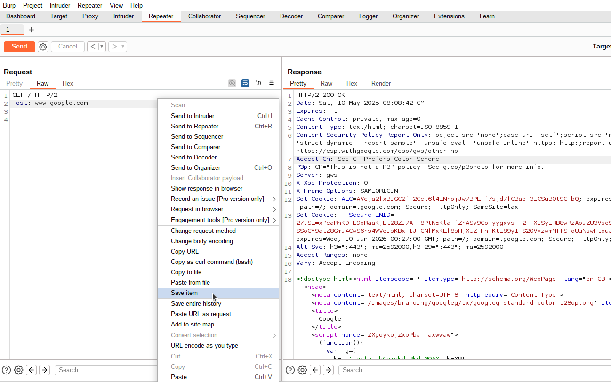

# CURL and Burp to Postman Converter

A Go tool that converts cURL a file of commands or a directory of Burp Suite XML files into Postman Collections.

## Overview

This tool helps API testers and developers easily migrate their existing API requests from cURL commands or Burp Suite to Postman. It supports:

- Converting cURL commands from text files
- Processing Burp Suite XML exports with base64-encoded HTTP requests
- Converting both formats to Postman Collection v2.1.0 JSON format
- Recursive directory scanning to process multiple files at once

## Installation

### Prerequisites

- Go 1.16 or higher
- [github.com/google/uuid](https://github.com/google/uuid) package

### Building the tool

1. Clone this repository or download the source code

2. Install the required dependencies:

```bash
go get github.com/google/uuid
```

3. Build the executable:

```bash
go build -o go2postman
```

## Usage

```bash
  -=[+] ... Go-2-Postman Postman Generator ... [+]=- 

 	The following syntax is for shorthand operational flags:

	-c	 | This is to load in a single text file with cURL commands, one per line. (short syntax for -curl-in)
	-b	 | This is to load a directory multiple burp repeater "saved item" files saved in a folder and generate a postman file. (short syntax for -burp-dir)
	-o	 | This option is for the generated a postman output file name. (short syntax for -postman-out)

  The following syntax is for longhand operational flags:

	-curl-in	 | This is to load in a single text file with cURL commands, one per line.
	-burp-dir	 | This is to load a directory multiple burp repeater "saved item" files saved in a folder and generate a postman file.
	-postman-out	 | This option is for the generated a postman output file name.

  The following shows examples of tool usage:

  ./go2postman -c list-of-curl-commands.txt -o postman-out-collection.json
  ./go2postman -curl-in list-of-curl-commands.txt -postman-out postman-out-collection.json
  ./go2postman -b BURP_XML_FILES/ -postman-out postman-out-collection.json

  ** Please note; it is only possible to import a list of commands OR a directory of burp XML files, NOT both! **
```

### Convert a single file of cURL commands

```bash
./go2postman -c list-of-curl-commands.txt -o postman-out-collection.json
```

or

```bash
./go2postman -curl-in list-of-curl-commands.txt -postman-out postman-out-collection.json
```

### Process a directory of Burp saved XML files recursively

```bash
./go2postman -b BURP_XML_FILES/ -postman-out postman-out-collection.json
```

The tool will:
1. Scan the directory recursively
2. Find all cURL command files (*.txt, *.curl) and Burp XML files in a directory(*.xml)
3. Parse and convert them to Postman format
4. Combine a list of curl commands or a dirtectory of Burp XML files into a single Postman collection
5. Save the collection to the specified output file

## Supported File Types

### cURL Command Files

- Files with `.txt` or `.curl` extensions containing cURL commands
- Each line should start with `curl `
- Example:
  ```
  curl -isk -H 'Sec-Ch-Ua: "Chromium";v="127"' -X 'GET' "https://example.com/api/resource"
  curl -isk -X 'POST' -H 'Content-Type: application/json' -d '{"key":"value"}' "https://example.com/api/resource"
  ```

### Burp Suite XML Files

- XML files exported from Burp Suite's Repeater or Proxy
  
- Files should have the `.xml` extension
- The tool supports base64-encoded requests in the Burp XML format
- Example:
  ```xml
  <?xml version="1.0"?>
  <!DOCTYPE items [
  <!ELEMENT items (item*)>
  <!ATTLIST items burpVersion CDATA "">
  <!ATTLIST items exportTime CDATA "">
  <!ELEMENT item (time, url, host, port, protocol, method, path, extension, request, status, responselength, mimetype, response, comment)>
  <!ELEMENT request (#PCDATA)>
  <!ATTLIST request base64 (true|false) "false">
  ]>
  <items burpVersion="2024.6.6" exportTime="Tue May 06 14:30:51 BST 2025">
    <item>
      <url><![CDATA[https://example.com/api/resource]]></url>
      <method><![CDATA[POST]]></method>
      <request base64="true">UE9TVCAvYXBpL3Jlc291cmNlIEhUVFAvMi4wDQo...</request>
    </item>
  </items>
  ```

## Output Format

The tool generates a Postman Collection v2.1.0 JSON file that can be imported directly into Postman:

1. Open Postman
2. Click "Import" in the top left
3. Select the generated JSON file
4. The collection will be imported with all your requests

## Features

- **HTTP Method Parsing**: Correctly extracts HTTP methods (GET, POST, PUT, DELETE, etc.)
- **URL Parsing**: Parses URLs and separates them into protocol, host, path and query components
- **Header Parsing**: Extracts headers from cURL commands and HTTP requests
- **Body Parsing**: Handles request bodies in various formats
- **Authentication Detection**: Automatically detects and configures Basic and Bearer token authentication
- **File Format Detection**: Automatically detects file types based on content signatures
- **Request Naming**: Intelligent naming of requests based on the URL path
- **Cookie Handling**: Preserves cookies in the requests

## Limitations

- Doesn't support all possible cURL options
- May not handle extremely complex or unconventional cURL syntax
- Doesn't support all Postman features (environment variables, pre-request scripts, tests)

## Troubleshooting

If you encounter any issues:

1. **"No items were found to convert"**: Check that your input files contain valid cURL commands or Burp XML data
2. **XML parsing errors**: Ensure your Burp XML files are properly formatted
3. **Invalid URLs**: Check that your cURL commands have valid URLs

## License

This project is licensed under the MIT License - see the LICENSE file for details.

## Contributing

Contributions are welcome! Please feel free to submit a Pull Request.

## Acknowledgements

- [Burp Suite](https://portswigger.net/burp) for the excellent web security testing tool
- [Postman](https://www.postman.com/) for the great API development environment
- [cURL](https://curl.se/) is a versatile command-line the supports multiple protocols.
